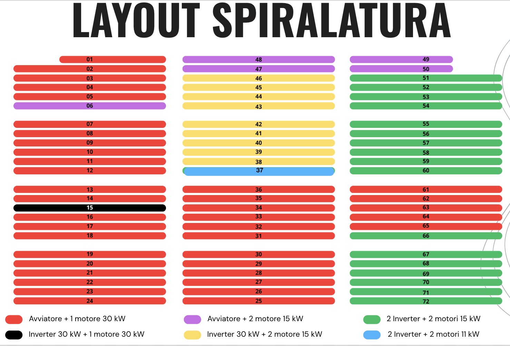

# Specifications for the Scheduler - LeMur

## 1 Scenario definition

We are in a manufacturing environment, where different machines produce a diverse of filaments under the purchase from different clients. 

We are tasked with scheduling operations to fulfill multiple orders within given **due dates** and **maximize production** throughput. **Each order** consists of one or more products, and **each product** requires a sequence of operations that may be grouped into **"velate"** (cycles).

### 1.1 Machines
We have 72 machines, divided into 6 groups by the company. Every machine is capable to produce every product. **(to review)**

- "Avviatore + 1 motore 30 kW"
- "Avviatore + 2 mototre 15 kW"
- "Inverter 30 kW + 1 motore 30 kW"
- "Inverter 30 kW + 2 motore 15 kW"
- "2 Inverter + 2 motori 15 kW"
- "2 Inverter + 2 mototri 11 kW"

For this problem, we define those in to 3 categories, which are:

- *Full Electronic* : machines that are fully programmable and have short need of human operators
- *Semi Electronic* : machines that are partially programmable and need for more time to set up
- *Manual*: machines fully mechanical that need human intervention
    
**(to review)**

### 1.2 Orders and Products

- **Orders** are a set of products to be made for a client.

**There are multiple orders to be handled** and there could be *same products* to be made in *different quantity* for *different orders*  

- **Products** are filament to be produced inside a client order. There are several products available for the client to produce

A product can be produced on *every machine*. **(to review)**
- **Tipically, products inside the same order, share the same due date**.

### 1.3 Operations

The production of a filament requires a set of **operations**. 

Operations are a set of activities, done by *the machines* or by *the employees*. The majority of operations are done by the machines, like the actual construnction of the product, while others have to be done by an employee like the substitution of the main material in to the machine.

If we look into the machine operations, **some require preparation or recharging before/after them**. In the schedule creation this impose a **sequentiality costraint** that has to be followed.(more details in the *Costraint* subchapter)

## 2 Problem definition
The problem posed can be approximated by the famous **Job Shop Problem (JSP)**, which is a **np-hard** problem.

Here the **JSP** definition:

*In a general job scheduling problem, we are given n jobs J1, J2, ..., Jn of varying processing times, which need to be scheduled on m machines with varying processing power, while trying to minimize the makespan a.k.a. the total length of the schedule*.

**Insert image of JSP**

### 2.1 Costraints

1. **Due date**: Every product production has to be terminated *before* the given due date.
2. **Machine preparation**: Has to occur *sequentially* before every production task
3. **Work shifts**: All the operations that require supervision and all the machine operations must be done(for the supervised) or end (for the machines) during the work shifts given by the company.
4. **Available workers**: There is a number of available operators that impose a maximum production capacity per day.   

## 3 Approaches
**(do we need this here?)**
 